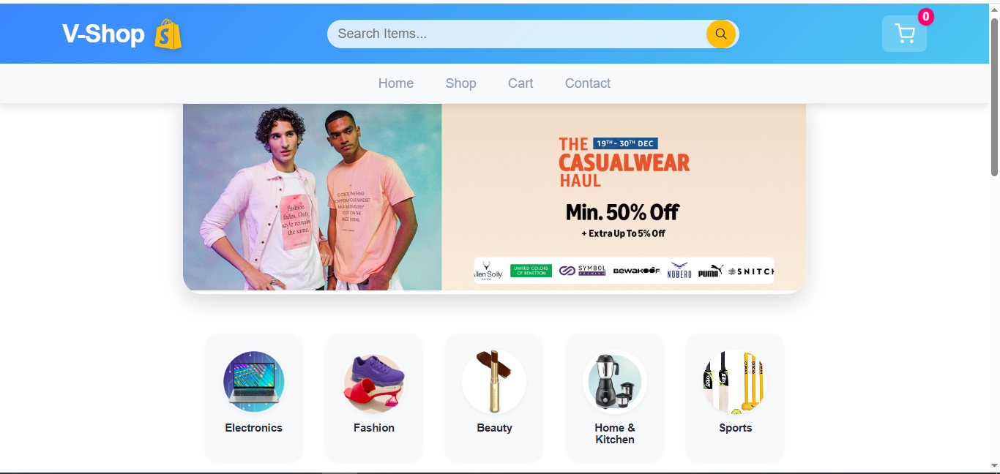
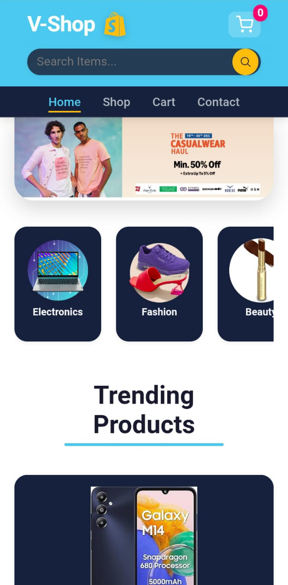

# V-Shop 🛍️

A modern, responsive e-commerce platform built with React and Redux Toolkit.

## Features

- 🛒 **Shopping Cart** - Add/remove items with persistent state management
- 📱 **Responsive Design** - Completely responsive with fluid typography
- 🌙 **Dark/Light Theme** - Automatic theme switching based on system preferences
- 🏷️ **Category Filtering** - Browse products by categories (Electronics, Fashion, Beauty, etc.)
- ⚡ **Fast Performance** - Built with React 18 and Vite
- 🎨 **Modern UI** - Clean design with CSS custom properties and smooth animations

## Screenshots


*Desktop view with light theme - Home page with product categories*


*Mobile view with dark theme - Home page with product categories*

## Tech Stack

- **Frontend:** React 18
- **State Management:** Redux Toolkit
- **Routing:** React Router
- **Styling:** CSS Modules with Custom Properties
- **Build Tool:** Vite

## Installation

1. Clone the repository:
```bash
git clone https://github.com/Qasim-asb/E-Commerce-React-Vite.git
cd E-Commerce-React-Vite